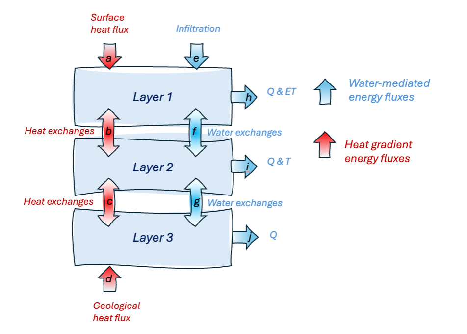

.. _soil_energy_exchanges:

LST-driven soil energy balance
==============================

The LST-driven soil energy balance module namely involves (1) closure of the total soil energy input and outputs, (2) intra-soil energy exchanges mediated by thermal gradients and water fluxes, (3) an LST-forced surface-to-suburface energy heat flux submodule, and (4) diagnostic derivations of soil temperature and liquid H2O fraction, in coordination with the soil H2O balance module. 

1. Closure of the soil energy inputs and outputs
------------------------------------------------

The soil energy balance is summarized as

.. math::

   \frac{dE}{dt} = E_{surface_in} +  E_{geology_in} - E_{H2O_in_out}

where \frac{dE}{dt} is the time-varying soil energy content, E_{surface_in} is the surface-to-subsurface gradient mediated thermal heat flux, E_{geology_in} is the upward thermal heat flux at the bottom boundary of the DALEC soil column, and E_{H2O_in_out} is the sum of all water-mediated input and output fluxes..

The three DALEC 1100 layers are specifically defined as 

.. math::

   \frac{dE1}{dt} = E_{surface_in} + E_{h2o_infil}  - E_{H2O_Q1} - E_{H2O_evap} - E_{H2O_transp1} - E_{LY1_2_LY2} - E_{H2O_LY1_2_LY2};

.. math::

   \frac{dE2}{dt} = E_{LY1_2_LY2} +E_{H2O_LY1_2_LY2} - E_{H2O_Q2}  - E_{H2O_transp2}  - E_{LY2_2_LY3} - E_{LY2_2_LY3} - E_{H2O_LY2_2_LY3};

.. math::

   \frac{dE2}{dt} = E_{geology_in} +  E_{LY2_2_LY3} + E_{H2O_LY2_2_LY3} - E_{h2o_Q3};

2. Water-mediated energy fluxes
-----------------------------------------------------------------------------

2. intra-soil energy exchanges mediated by thermal gradients and water fluxes
-----------------------------------------------------------------------------

The bulk soil energy inputs consist of (i) ground heat flux, (ii) inter-layer thermal exchanges, (iii) geological heat flux, and (iv) water-flux mediated energy gains and losses. The ground heat flux is modeled using the following formulation, where:

.. math::

   F_{ground\_heat} [PAUL REVIEW] = \kappa_{LY1} \frac{LY1 - LST}{0.5 d_{LY1}} 

Internal soil heat exchanges are simulated as

.. math::

   F_{exchange\{n,n+1\}} [PAUL REVIEW] = \sqrt{K_{LYn}K_{LYn+1}} \frac{T_{LYn+1} - T_{LYn}}{0.5(d_{LYn}+d_{LYn+1})} 

where :math:`K_{LYn}` represents the :math:`n^{th}` layer thermal conductivity.

Geological heat flux is assumed to be a constant input of 105 mW/m². Water-flux mediated energy exchanges are calculated based on the product of H₂O flux and temperature-based calculation of energy per unit volume H₂O. Infiltration-based inputs are assumed to be at 0°C temperature for snowmelt and max(T₂m, 0°C) for liquid precipitation inputs; subsurface runoff losses from layer :math:`n` are assumed to be at the corresponding layer temperature, :math:`T_{LYn}`.

3. LST-forced surface-to-suburface energy heat flux submodule
-------------------------------------------------------------

4. diagnostic derivations of soil temperature and liquid H2O fraction, in coordination with the soil H2O balance module. 
------------------------------------------------------------------------------------------------------------------------
