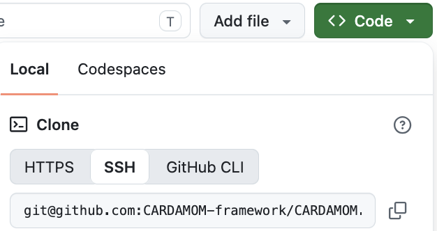

Getting Started with CARDAMOM
Getting Started with CARDAMOM
==============================

"Installing" CARDAMOM
---------------------

Instructions here are for Mac, and transfer to linux/unix. No windows installation instructions provided at the moment.

Required Installation Steps
~~~~~~~~~~~~~~~~~~~~~~~~~~~~

.. note::

   * Install homebrew (if you don't already have it: https://brew.sh)
   * Install netcdf library (if you don't already have it)

     + Type ``brew install netcdf`` in terminal window (Mac), see step (1) for installing brew.
     + Anthony, Alex: ``setenv('CARDAMOM_NC_CONFIG_PATH','/usr/local/bin/nc-config')``
     + For PC: no supported solution yet… (Paul: add potential windows solution)

   * You may also need:

     + ``brew install python`` (even for matlab users)
     + Install pip on macOS: https://www.geeksforgeeks.org/how-to-install-pip-in-macos/
     + ``pip3 install netcdf4``

Git clone from Github
~~~~~~~~~~~~~~~~~~~~

+ **Step 1.** Type ``cd /path/to/your/environment/`` in your mac terminal. This can be your default home directory or another directory for storing CARDAMOM code.

+ **Step 2.** Type ``git clone git@github.com:CARDAMOM-framework/CARDAMOM.git`` in your terminal window. If successful, you will have a newly created ``/path/to/your/environment/CARDAMOM`` folder.

+ **Additional resources:** For the original source, go to https://github.com/CARDAMOM-framework/CARDAMOM, click on the green "Code" button, and select git clone with ssh.

The "ssh" option will provide the "git@github.com:CARDAMOM-framework/CARDAMOM.git" text used in Step 2, but you may choose to download the code differently.

.. warning::
   **Do not use the .zip approach** (!) unless you only intend to download the code once, and do not anticipate collaborating with the team.

Compiling CARDAMOM
~~~~~~~~~~~~~~~~~~

+ **Step 1.** Navigate to your CARDAMOM folder: ``cd /path/to/your/environment/CARDAMOM``

+ **Step 2.** Run ``./BASH/CARDAMOM_COMPILE.sh``. More likely than not, you will need to install some libraries with brew install.

+ **Step 3.** (If needed) Install missing libraries using homebrew, and repeat **Step 2** until successful. See Tips and FAQ to debug this step.

Tips
^^^^

If you are working on a new machine, make sure to re-install required packages like python, homebrew, etc.

FAQ
^^^

**Q:** "I get 'Error: could not find any nc-config command.' or something like that, what do I do?"

**A:** Install netcdf using homebrew::

   brew install netcdf

**Q:** "git clone doesn't work, because github needs a key: what do I do now?"

**A:** To get a github key, follow instructions here: https://docs.github.com/en/authentication/connecting-to-github-with-ssh/adding-a-new-ssh-key-to-your-github-account

**Q:** I get a fatal error when typing ``git clone https://github.com/CARDAMOM-framework/CARDAMOM.git``, what should I do?

**A:** (NOTE: make link to CARDAMOM GITHUB.md, Shuang's user guide).

+ Demos below will compile CARDAMOM and run short assimilation runs and forward runs for testing. There are options in both Python and Matlab. Check Appendix for additional tools written in Matlab and Python.

CARDAMOM Github User Must Read
~~~~~~~~~~~~~~~~~~~~~~~~~~~~~~~

After you clone the CARDAMOM repository to your local machine, please take a minute to go through the first section in `CARDAMOM_GIT_MUST_READ.md <https://github.com/CARDAMOM-framework/CARDAMOM/blob/main/CARDAMOM_GIT_MUST_READ.md>`_. We recommend all users follow the instructions in order to effectively maintain the CARDAMOM github environment.
